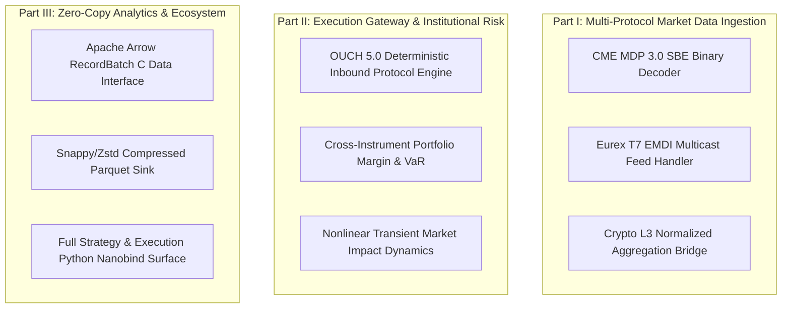

# Implementation Plan: mog Architectural Roadmap

This document outlines the high-priority engineering roadmap for `mog`:
* **Part I: Multi-Protocol Market Data Ingestion**: Direct binary parsing of CME futures and European derivatives.
* **Part II: Execution Gateway & Institutional Trading**: OUCH 5.0 order entry, cross-instrument margin, and impact dynamics.
* **Part III: High-Throughput Analytics & Zero-Copy API**: PyArrow C Data Interface, columnar streaming, and expanded Python surfaces.

---

---

# Part I: Multi-Protocol Market Data Ingestion

### 1. CME MDP 3.0 (Simple Binary Encoding - SBE)
* **Design**: Direct binary parsing of CME futures and options market data with FIX/FAST template decoding.
* **Architecture**: Direct struct overlay on memory buffers with zero heap allocations and inline endian conversion.

### 2. Eurex T7 EMDI Multicast Feed Handler
* **Design**: Multicast feed handler for European cash and derivatives markets.
* **Architecture**: Deterministic order book reconstruction across multi-channel packet streams with gap recovery.

### 3. Crypto Normalized L3 Ingestion Bridge
* **Design**: Normalized L3 and L2 delta feeds for Binance, Coinbase, and OKX.
* **Architecture**: Zero-copy JSON/WebSocket framing into native `mog::Message` frames.

---

# Part II: Execution Gateway & Institutional Risk

### 1. OUCH 5.0 Deterministic Order Entry Engine
* **Design**: Enter Order, Replace Order, Cancel Order, and Mass Cancel over binary OUCH 5.0 protocols.
* **Architecture**: Sequenced inbound matching engine clocking replicating exchange-native queue priority and outbound execution reports.

### 2. Real-Time Portfolio Margin & VaR
* **Design**: Deterministic portfolio-level SPAN and VaR margin calculators updated tick-by-tick on every execution.
* **Architecture**: Constant-time matrix updates with AVX-512 vectorization across multi-asset positions.

### 3. Nonlinear Transient Market Impact Model
* **Design**: Almgren-Chriss square-root temporary and permanent market impact with endogenous order book liquidity refills.
* **Architecture**: Sub-nanosecond impact kernel evaluated on fill dispatches.

---

# Part III: Zero-Copy Analytics & Ecosystem

### 1. Apache Arrow C Data Interface
* **Design**: Stream telemetry, book snapshots, and trade records directly into Apache Arrow `RecordBatch` buffers without intermediate serialization.
* **Architecture**: Direct pointer passing to Python (PyArrow, Polars, DuckDB) via C Data Interface.

### 2. High-Throughput Parquet Sink
* **Design**: Columnar disk writer emitting Snappy and Zstd compressed Apache Parquet files for long-term historical archives.

### 3. Complete Python Nanobind Public API Surface
* **Design**: Expose `StrategyRunner`, `simrun::run()`, `tearsheet::compute()`, and `ColumnLogReader` to Python.
