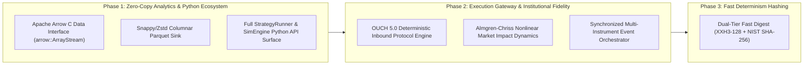

# Engineering Roadmap: mog Architecture & Expansions

This document outlines the focused, high-leverage architectural roadmap for `mog`.

---

---

## Phase 1: Zero-Copy Analytics & Python Ecosystem

Highest leverage for quantitative research, backtest evaluation, and data pipelines.

### 1. Apache Arrow C Data Interface (`arrow::ArrayStream`)
* **Objective**: Stream trade tapes, order book snapshots, and execution logs directly into Python without memory copies or serialization overhead.
* **Architecture**: 
  * Expose an in-memory Arrow C Data Interface structure (`ArrowArrayStream` / `ArrowSchema`) directly from `Recorder` ([include/mog/Trades.hpp](include/mog/Trades.hpp)) and `Tearsheet` ([include/mog/Tearsheet.hpp](include/mog/Tearsheet.hpp)).
  * Zero-copy consumption in Python via **Polars** (`pl.from_arrow()`), **DuckDB**, or **PyArrow**.
  * Eliminates intermediate CSV serialization and allows querying 50M replayed rows in milliseconds.

### 2. High-Throughput Columnar Parquet Sink
* **Objective**: Replace heavy CSV disk dumps with ultra-compressed, production-ready `.parquet` files.
* **Architecture**:
  * Implement a zero-allocation columnar buffer writer that encodes columns using Dictionary, Run-Length Encoding (RLE), and Snappy/Zstd compression.
  * Achieves 10x to 30x storage reduction over raw CSV while enabling instant column pruning during downstream research.

### 3. Complete Python Nanobind API Surface
* **Objective**: Allow quant researchers to write, backtest, and inspect strategies natively from Python without compiling custom C++ binaries for every experiment.
* **Architecture**:
  * Expand [python/mog/_core.cpp](python/mog/_core.cpp) to expose `StrategyRunner`, `SimEngine`, `tearsheet::compute()`, and `TimeTravelSession`.
  * Deliver strategy callback events (`on_order_book_update`, `on_order_fill`) into Python while preserving native C++ replay speeds for the background engine loop.

---

## Phase 2: Execution Gateway & Institutional Fidelity

Bridges simulated order flow with institutional exchange protocols and market dynamics.

### 1. OUCH 5.0 Deterministic Inbound Protocol Engine
* **Objective**: Mirror NASDAQ's native order submission protocol (OUCH 5.0) symmetrically with the ITCH market data parser.
* **Architecture**:
  * Zero-copy parser for binary OUCH messages: `Enter Order`, `Replace Order`, `Cancel Order`, `System Event`, `Order Accepted`, `Order Executed`, `Order Cancelled`, `Order Rejected`.
  * Strict layout audits (`static_assert(offsetof(...))`) matching NASDAQ wire specifications.
  * Inbound queue ordering replicating exchange hardware network interface timestamps.

### 2. Almgren-Chriss Nonlinear Market Impact Model
* **Objective**: Prevent unrealistic fill assumptions for large-scale institutional orders by modeling price impact.
* **Architecture**:
  * Implement square-root temporary and permanent price impact:
    $$\Delta P_{\text{perm}} = \gamma \cdot \sigma \cdot \left(\frac{Q}{V}\right)^\alpha, \quad \Delta P_{\text{temp}} = \eta \cdot \sigma \cdot \left(\frac{q}{v}\right)^\beta$$
  * Couple aggressive order consumption with endogenous book liquidity refill dynamics, penalizing large aggressive sweeps with realistic slippage.

### 3. Synchronized Multi-Instrument Cross-Asset Orchestrator
* **Objective**: Upgrade [include/mog/Orchestrate.hpp](include/mog/Orchestrate.hpp) to support multi-leg pairs trading and statistical arbitrage strategies across multiple stocks.
* **Architecture**:
  * Replace independent linear time broadcasts with a unified multi-instrument event priority queue.
  * Interleave tick events across all instruments in exact global timestamp sequence, allowing cross-asset strategies to react instantaneously to lead-lag signals.

---

## Phase 3: Fast Determinism Digest Acceleration

Speed up test suite execution, differential fuzzing, and local benchmark runs.

### 1. Dual-Tier Fast Digest (XXH3-128 + SHA-256)
* **Objective**: Remove cryptographic SHA-256 overhead from inner-loop benchmarking and fuzzing while preserving golden verification gates.
* **Architecture**:
  * Introduce a fast 128-bit vectorized digest (`XXH3_128bits` or SIMD SWAR fold) for local sweeps, fuzz runs, and hot benchmark loops (~1 ns/op vs ~40 Ir/msg for SHA-256).
  * Retain NIST SHA-256 ([include/mog/Sha256.hpp](include/mog/Sha256.hpp)) for CI golden anchors and pull-request verification.

