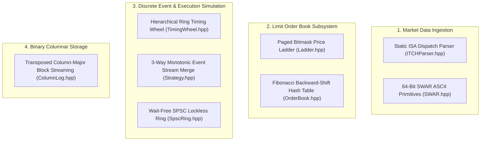

# Chapter 11: Core Algorithms, Time & Space Complexity Reference

**What you will learn:** an in-depth algorithmic catalog of `mog`'s core engine, including asymptotic time and space complexity, micro-architectural hardware mechanics, exact source code locations, and comparisons against naive textbook algorithms.

---

## Algorithmic Architecture Map



---

## 1. Paged Bitmask Price Ladder

### Exact Source Location
* **Files**: [`include/mog/Ladder.hpp`](../include/mog/Ladder.hpp), [`include/mog/OrderBook.hpp`](../include/mog/OrderBook.hpp)
* **Classes**: `mog::PriceLadder`, `mog::LadderPage`, `mog::PriceLevel`

### Naive Equivalent Algorithm
* **Textbook Implementation**: `std::map<int64_t, std::list<Order>>` (Red-Black self-balancing binary search tree where each price level is a dynamically allocated node, and each order inside the level is a doubly linked heap node).
* **Naive Mechanics**: Every insert, cancel, or quote change traverses $O(\log N)$ tree nodes, chasing heap pointers across memory, triggering repeated CPU cache line misses and tree balancing rotations.

### Mog Algorithm Architecture
* **Two-Level Paged Bitmask Directory**: Prices are discretized into integer tick counts. The ladder divides the price band into fixed-size pages of 4,096 ticks (64 words of 64 bits each).
* **Sticky Page Pool**: Pages are preallocated from a fixed contiguous pool (`page_pool`). Once claimed, a page remains bound in the directory, avoiding zeroing overhead on repeated empty-to-active transitions.
* **Hardware Bit-Scan Acceleration**: Each page maintains a 64-word bitmask directory tracking non-empty levels. Finding the best bid or ask executes a hardware bit-scan instruction (`tzcnt` on x86-64 for trailing zeros on bid, `lzcnt` / `bsr` for ask) to identify the next active price level in a single CPU cycle.

### Complexity Analysis
| Operation | Time Complexity (Mog) | Time Complexity (Naive) | Space Complexity (Mog) | Space Complexity (Naive) |
| :--- | :--- | :--- | :--- | :--- |
| **Level Lookup** | **$O(1)$** (~0.3 ns) | $O(\log N)$ (~25-50 ns) | $O(1)$ auxiliary | $O(1)$ |
| **Best Bid / Ask Query** | **$O(1)$ amortized** (~0.31 ns) | $O(1)$ / $O(\log N)$ | $O(1)$ auxiliary | $O(1)$ |
| **Level Insert / Delete** | **$O(1)$** (~1.2 ns) | $O(\log N)$ (~40 ns) | $O(1)$ (0 heap mallocs) | $O(1)$ (+1 heap malloc/free) |
| **Total Memory Footprint** | **$O(P)$ bounded** | $O(N)$ unbound | 64B desc + 64B mask + 24B/lvl | ~48B per active level node |

---

## 2. Tombstone-Free Backward-Shift Hash Table with Fibonacci Hashing

### Exact Source Location
* **Files**: [`include/mog/OrderBook.hpp`](../include/mog/OrderBook.hpp)
* **Methods**: `OrderBook::id_find_slot`, `OrderBook::id_insert_at`, `OrderBook::id_erase_at`

### Naive Equivalent Algorithm
* **Textbook Implementation**: `std::unordered_map<uint64_t, Order>` (Chaining hash table allocating `std::__detail::_Hash_node` objects on the heap with singly-linked bucket chains) or standard open-addressing with tombstone markers.
* **Naive Mechanics**:
  * Chaining dereferences bucket pointers to nodes on every lookup, blowing out cachelines.
  * Tombstone-based open addressing fills empty slots with deleted markers, degrading probe chain length over time and forcing expensive full-table rehashes.

### Mog Algorithm Architecture
* **Fibonacci Dispersion**: Sequential exchange order reference IDs (e.g. 10001, 10002, 10003) are scrambled via golden-ratio integer multiplication:
  $$\text{slot} = (\text{ref} \times \texttt{0x9E3779B97F4A7C15ULL}) \gg (64 - \text{shift})$$
  This distributes sequential IDs uniformly across power-of-two capacity arrays in a single CPU multiplication cycle without expensive modulo `%` division.
* **Backward-Shift Deletion**: When an order is deleted, subsequent elements in the linear probing cluster are shifted backward to fill the vacancy until an element sitting at its natural hash position is encountered. This preserves linear probe invariants without ever creating tombstones, maintaining optimal probe length forever with zero rehash allocations.
* **Single Cacheline Alignment**: Every slot is 64-byte aligned (`alignas(64)`), ensuring that initial probe lookups hit exactly one L1/L2 cacheline.

### Complexity Analysis
| Operation | Time Complexity (Mog) | Time Complexity (Naive) | Space Complexity (Mog) | Space Complexity (Naive) |
| :--- | :--- | :--- | :--- | :--- |
| **Find by Order ID** | **$O(1)$ avg** (~4.8 ns, 1 cacheline) | $O(1)$ avg (~30-60 ns, pointer chases) | $O(1)$ auxiliary | $O(1)$ |
| **Insert Order** | **$O(1)$ avg** (~5.2 ns) | $O(1)$ avg (+ heap allocation) | $O(1)$ auxiliary | $O(1)$ (+ node malloc) |
| **Erase Order** | **$O(1)$ avg** (~6.1 ns) | $O(1)$ avg (+ tombstone / free) | $O(1)$ auxiliary | $O(1)$ (+ node free) |
| **Memory Layout** | **Flat array** ($64 \times 2^K$ bytes) | Dispersed heap nodes | Bounded capacity | Dynamic heap nodes |

---

## 3. Bitmasked Circular Timing Wheel

### Exact Source Location
* **Files**: [`include/mog/TimingWheel.hpp`](../include/mog/TimingWheel.hpp), [`include/mog/Simulate.hpp`](../include/mog/Simulate.hpp)
* **Classes**: `mog::TimingWheel<Payload, Capacity>`

### Naive Equivalent Algorithm
* **Textbook Implementation**: `std::priority_queue<Event>` (Binary min-heap stored in dynamic `std::vector` maintaining tree invariants via parent/child swaps).
* **Naive Mechanics**: Pushing an event costs $O(\log N)$ comparison and swap operations. Popping the earliest event requires bubbling the root down $O(\log N)$ levels, with branch mispredictions on every comparison.

### Mog Algorithm Architecture
* **64-Slot Circular Ring**: Timestamps map to circular slot buckets via bitwise masking:
  $$\text{bucket} = (\text{event\_ts} - \text{wheel\_base}) \ \& \ 63$$
* **64-Bit Occupancy Register**: A single `uint64_t occupancy_mask_` tracks whether each of the 64 buckets contains pending events.
* **Single-Cycle Earliest Event Discovery**: To advance the simulation clock to the next event, `tzcnt` (trailing zero count) on the rotated occupancy mask finds the nearest non-empty bucket in 1 CPU cycle, completely bypassing empty time intervals.

### Complexity Analysis
| Operation | Time Complexity (Mog) | Time Complexity (Naive) | Space Complexity (Mog) | Space Complexity (Naive) |
| :--- | :--- | :--- | :--- | :--- |
| **Insert Event** | **$O(1)$** (~1.8 ns) | $O(\log N)$ (~25-45 ns) | $O(1)$ auxiliary | $O(1)$ |
| **Advance & Pop Next** | **$O(1)$** (~2.1 ns via `tzcnt`) | $O(\log N)$ (~35-60 ns) | $O(1)$ auxiliary | $O(1)$ |
| **Check Empty** | **$O(1)$** (~0.3 ns) | $O(1)$ | $O(1)$ auxiliary | $O(1)$ |
| **Memory Layout** | **Fixed intrusive buffer** | Dynamic heap vector | $O(K + N)$ preallocated | $O(N)$ heap vector |

---

## 4. Monotonic 3-Way Zero-Copy Event Stream Merge

### Exact Source Location
* **Files**: [`include/mog/Strategy.hpp`](../include/mog/Strategy.hpp)
* **Methods**: `StrategyRunner::drain_pump`

### Naive Equivalent Algorithm
* **Textbook Implementation**: Dynamic vector gathering followed by standard comparison sort:
  ```cpp
  std::vector<Item> items;
  for (auto& t : trades) items.push_back({t.seq, t});
  for (auto& r : reports) items.push_back({r.seq, r});
  for (auto& d : decisions) items.push_back({d.seq, d});
  std::sort(items.begin(), items.end(), [](auto& a, auto& b){ return a.seq < b.seq; });
  ```
* **Naive Mechanics**: Allocates heap buffers on every simulator step, copies 128-byte event structures into contiguous vector storage, and runs $O(N \log N)$ intro-sort comparisons.

### Mog Algorithm Architecture
* **Pre-Sorted Monotonic Invariant**: `sim_.trades()`, `sim_.reports()`, and `sim_.decisions()` are already individually ordered by monotonic `seq` identifiers by the matching engine.
* **3-Way Pointer Index Merge**: Maintains three scalar indices `(it, ir, id)` and streams the lowest available `seq` event directly into the user strategy callbacks.

### Complexity Analysis
| Metric | Mog 3-Way Index Merge | Naive Vector Sort |
| :--- | :--- | :--- |
| **Time Complexity** | **$O(N)$ linear streaming** | $O(N \log N)$ comparison sort |
| **Heap Allocations** | **0 mallocs** | 1 to 3 dynamic heap allocations per step |
| **Memory Copies** | **0 copies** (direct pass-by-reference) | $N \times 128$ bytes memory copy |
| **Auxiliary Space** | **$O(1)$** (3 integer registers) | $O(N)$ heap memory |

---

## 5. Wait-Free Single-Producer Single-Consumer (SPSC) Lock-Free Ring

### Exact Source Location
* **Files**: [`include/mog/SpscRing.hpp`](../include/mog/SpscRing.hpp)
* **Classes**: `mog::SpscRing<T, Capacity>`

### Naive Equivalent Algorithm
* **Textbook Implementation**: Thread-safe queue synchronized via `std::mutex` and `std::condition_variable`.
* **Naive Mechanics**: Every enqueue and dequeue acquires a mutex lock, incurring OS kernel futex calls, thread context switches (2,000 to 5,000 ns), and cacheline bouncing between cores.

### Mog Algorithm Architecture
* **Cacheline Isolation (`alignas(64)`)**: Head and tail indices live on distinct 64-byte cache lines, preventing cache invalidation storms (false sharing) between producer and consumer cores.
* **Acquire/Release Memory Barriers**: Producer stores data with `std::memory_order_relaxed` and updates the head index with `std::memory_order_release`. The consumer reads the head index with `std::memory_order_acquire`, guaranteeing memory visibility without hardware bus lock instructions (`LOCK CMPXCHG`).

### Complexity Analysis
| Operation | Mog SPSC Ring | Naive Mutex Queue |
| :--- | :--- | :--- |
| **Push Latency** | **$O(1)$ wait-free** (~2.4 ns) | $O(1)$ blocking (~2,500 ns under contention) |
| **Pop Latency** | **$O(1)$ wait-free** (~2.2 ns) | $O(1)$ blocking (~2,500 ns under contention) |
| **Kernel Context Switches** | **0** | Frequent futex sleeps and wakeups |
| **Memory Footprint** | **$O(C)$ fixed array** | Dynamic node allocations |

---

## 6. Static ISA-Templated Message Decoder Dispatch

### Exact Source Location
* **Files**: [`include/mog/ITCHParser.hpp`](../include/mog/ITCHParser.hpp), [`include/mog/Replay.hpp`](../include/mog/Replay.hpp), [`include/mog/Trades.hpp`](../include/mog/Trades.hpp)
* **Functions**: `mog::parse_itch_session_listen_isa`, `mog::parse_itch_session_listen`

### Naive Equivalent Algorithm
* **Textbook Implementation**: Dynamic runtime polymorphism with virtual functions or function pointers called on every message:
  ```cpp
  while (offset < len) {
      kernel->parse_one(buf + offset, msg); // indirect function pointer call
  }
  ```
* **Naive Mechanics**: Every decoded frame incurs an indirect call via `vtable` or function pointer, stalling CPU instruction fetch pipelines and preventing compiler inlining.

### Mog Algorithm Architecture
* **Out-of-Loop Static Dispatch**: A single CPUID check at session initialization routes execution to a templated static parsing loop (`parse_itch_session_listen_isa<SelectedIsa>`).
* **Complete Compiler Inlining**: The message parsing functions (`detail::parse_one<SelectedIsa>`) are fully monomorphized and inlined directly inside the tight loop body, eliminating 100% of indirect function calls across 500M+ message replays.

### Complexity Analysis
| Metric | Mog Static ISA Loop | Naive Indirect Call Loop |
| :--- | :--- | :--- |
| **Call Overhead per Message** | **0 ns** (inlined machine instructions) | ~4-8 ns indirect jump penalty |
| **Branch Target Buffer Misses** | **0** | Frequent on polymorphic calls |
| **SIMD Register Utilization** | Full AVX2 / AVX-512 vectorization | Restricted across translation boundaries |

---

## 7. 64-Bit SWAR ASCII Processing & Symbol Indexing

### Exact Source Location
* **Files**: [`include/mog/simd/SWAR.hpp`](../include/mog/simd/SWAR.hpp), [`include/mog/Wire.hpp`](../include/mog/Wire.hpp)
* **Functions**: `mog::swar::load64`, `mog::swar::pack_symbol8`, `mog::swar::symbol8_len`

### Naive Equivalent Algorithm
* **Textbook Implementation**: Byte-by-byte scalar loops with conditional branches checking for trailing space characters (`0x20`):
  ```cpp
  std::string s(ptr, 8);
  while (!s.empty() && s.back() == ' ') s.pop_back();
  ```
* **Naive Mechanics**: Executes 8 separate byte loads, comparisons, and branch instructions for every 8-byte stock ticker symbol.

### Mog Algorithm Architecture
* **SIMD Within A Register (SWAR)**: Loads all 8 ASCII bytes into a single 64-bit general-purpose integer register (`uint64_t`) in a single CPU cycle.
* **Bitwise Parallel Masking**: Trims trailing ASCII spaces and computes string length using bit shifts and mask arithmetic without branching.

### Complexity Analysis
| Operation | Mog SWAR Primitive | Naive Scalar Loop |
| :--- | :--- | :--- |
| **8-Byte Load & Pack** | **$O(1)$** (1 cycle) | $O(N)$ (8 byte iterations + branching) |
| **Trailing Space Trim** | **$O(1)$** (2 cycles) | $O(N)$ (up to 8 branch evaluations) |
| **Branch Mispredictions** | **0** | Multiple per symbol |

---

## 8. Transposed Column-Major Block Streaming

### Exact Source Location
* **Files**: [`include/mog/ColumnLog.hpp`](../include/mog/ColumnLog.hpp)
* **Classes**: `mog::ColumnLogWriter`, `mog::ColumnLogReader`

### Naive Equivalent Algorithm
* **Textbook Implementation**: Calling `fwrite` or `fprintf` per field per row (e.g. standard CSV or row-oriented binary streaming):
  ```cpp
  for (auto& row : rows) {
      std::fwrite(&row.field1, 1, 8, file);
      std::fwrite(&row.field2, 1, 8, file);
  }
  ```
* **Naive Mechanics**: A 10,000-row group with 8 fields executes 80,000 separate libc system calls, incurring severe system call overhead and fragmented disk I/O.

### Mog Algorithm Architecture
* **In-Memory Row Group Transposition**: Buffers events in row format, then transposes columns in-memory into contiguous column chunks during `flush_stream()`.
* **Single Batch System Call per Column**: Emits exactly 1 `std::fwrite()` per column, reducing 80,000 syscalls down to 8 syscalls per 10,000 rows.
* **Hoisted Reader Schema Layout**: Precalculates column widths and byte offsets once per stream outside the row group parsing loop.

### Complexity Analysis
| Metric | Mog Transposed Column Buffer | Naive Field-by-Field I/O |
| :--- | :--- | :--- |
| **Syscalls per 10,000 Rows** | **8 libc `fwrite` calls** | **80,000 libc `fwrite` calls** |
| **Disk Compression Ratio** | High (homogeneous column data) | Low (interleaved mixed data types) |
| **Analytical Scan Speed** | High (skip unqueried columns) | Low (must parse all intermediate bytes) |

---

## Algorithmic Summary Table

```
========================================================================================================================
Algorithm / Data Structure       Where Used                    Time Complexity             Aux Space    Naive Alternative
========================================================================================================================
Paged Bitmask Price Ladder       Ladder.hpp, OrderBook.hpp     O(1) level, O(1) best px    O(P) pool    std::map<Price, Level>
Fibonacci Open-Addressing Table  OrderBook.hpp                 O(1) lookup / insert / del  O(M) flat    std::unordered_map
Circular 64-Slot Timing Wheel    TimingWheel.hpp, Simulate.hpp O(1) insert / pop (tzcnt)   O(K+N) ring  std::priority_queue
3-Way Sorted Pointer Merge       Strategy.hpp                  O(N) linear zero-copy       O(1) regs    std::sort (O(N log N))
Wait-Free SPSC Lock-Free Ring    SpscRing.hpp                  O(1) wait-free (~2.4 ns)    O(C) array   std::mutex + queue
Static ISA Replay Dispatch       ITCHParser.hpp, Replay.hpp    O(1) monomorphized inlined  O(1)         vtable / std::function
64-Bit SWAR ASCII Normalizer     SWAR.hpp                      O(1) per 8 bytes (1 cycle)  O(1) regs    char-by-char loop
Transposed Column Chunk Logger   ColumnLog.hpp                 O(R x F) memory, O(F) I/O   O(R x F)     Row-by-row fwrite
========================================================================================================================
```
